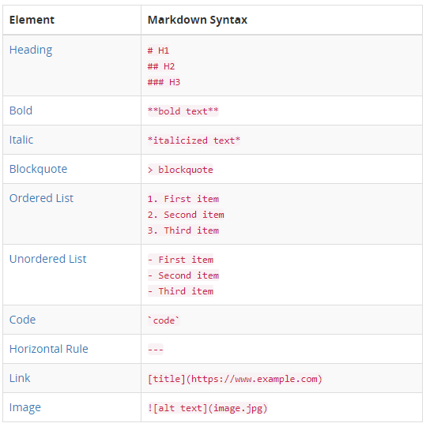
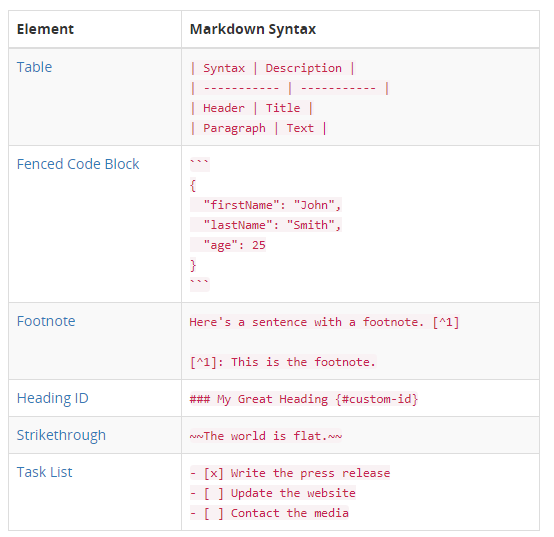

# Markdown 

> Markdown 的目标是实现「易读易写」。  
>
> Markdown是一种轻量级标记语言，您可以使用它将格式化元素添加到明文文本文档中。Markdown于2004年由John Gruber创建，现在是全球最受欢迎的标记语言之一。 

## Reference

- [markdown1.01](https://daringfireball.net/projects/markdown/)
- [Markdown Cheatsheet](https://github.com/adam-p/markdown-here/wiki/Markdown-Cheatsheet)
- [markdownguide](https://www.markdownguide.org/getting-started)
- [**awesome-markdown**](https://github.com/mundimark/awesome-markdown)

## Point

- 易读易写

##  Basic Syntax

These are the elements outlined in John Gruber's original design document. All Markdown applications support these elements.

## Extended Syntax

These elements extend the basic syntax by adding additional features. Not all Markdown applications support these elements.

## User test

粗体    **test**

斜体     _test_

下划线  <u>test</u>

上标  test[^2]

[]: test

表达式 $x^2=y$

​            $x_{y-2}$

转义   \**

字符 :happy:

 

[^2]: 