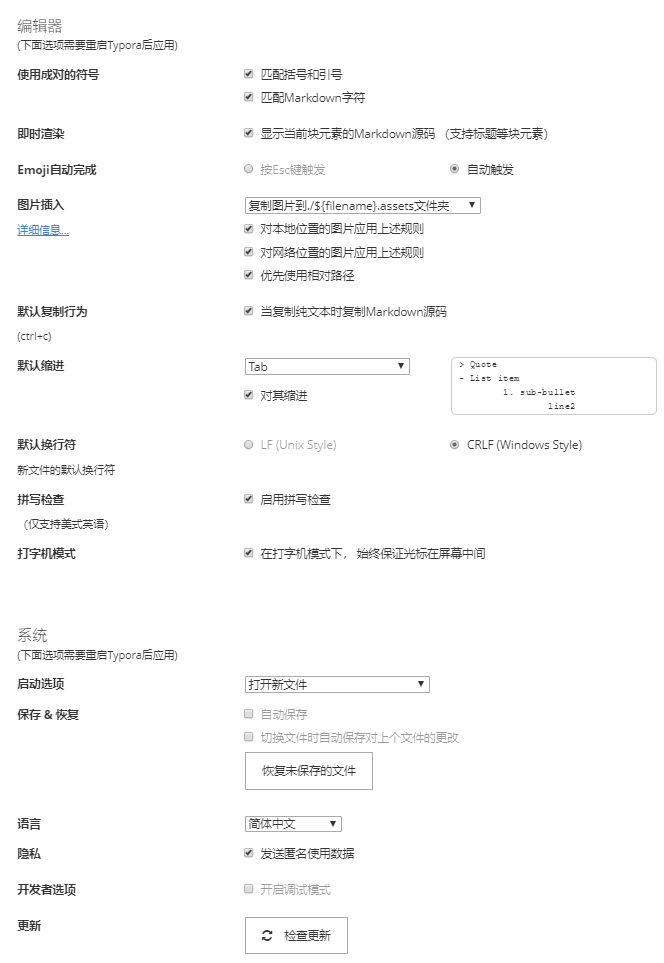

# Typora

> 一款简单的强大的跨平台的支持gfm等的Markdown编辑器

## Reference

- [Typora官网](https://www.typora.io/)
- [Typora教程](https://ke.qq.com/course/204170#term_id=100241748)

## Point

- `学会Typora的思想，所看即所得`

- `学会操作快捷键`

	

### 安装Typora

* [下载 Typora](https://www.typora.io/#windows)
* 插件介绍
	* [writage](http://www.writage.com/)：markdown转word

###  设置Typora

### Typora Hot Key

| 功能               | 解释or快捷键                           |
| ------------------ | -------------------------------------- |
| 无序列表           | 输入-之后输入空格                      |
| 有序列表           | 输入数字+“.”之后输入空格               |
| 任务列表           | -[空格]空格 文字                       |
| 标题               | ctrl+数字                              |
| 表格               | ctrl+t                                 |
| 生成目录           | [TOC]按回车                            |
| 选中一整行         | ctrl+l                                 |
| 选中单词           | ctrl+d                                 |
| 选中相同格式的文字 | ctrl+e                                 |
| 跳转到文章开头     | ctrl+home                              |
| 跳转到文章结尾     | ctrl+end                               |
| 搜索               | ctrl+f                                 |
| 替换               | ctrl+h                                 |
| 引用               | 输入>之后输入空格                      |
| 代码块             | ctrl+alt+f                             |
| 加粗               | ctrl+b                                 |
| 倾斜               | ctrl+i                                 |
| 下划线             | ctrl+u                                 |
| 删除线             | alt+shift+5                            |
| 插入图片           | 直接拖动到指定位置即可或者ctrl+shift+i |
| 插入链接           | ctrl+k                                 |
